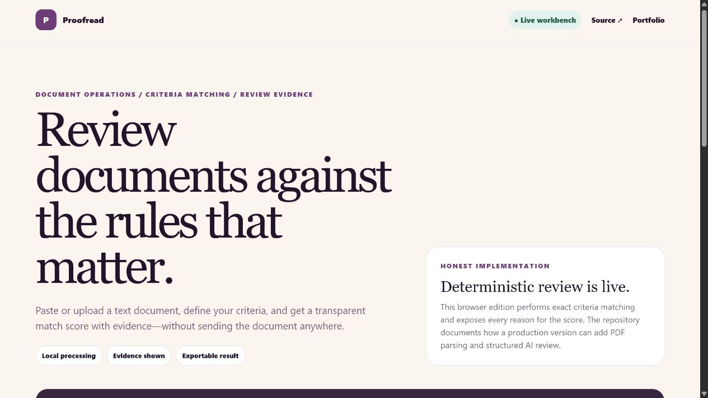

# Document Review Workbench

[](https://github.com/rongali-commits/document-review-workbench/actions/workflows/ci.yml)
[Live application](https://rongali-commits.github.io/document-review-workbench/) · [Portfolio](https://www.rongalichaitanya.com) · [Discuss a document workflow](mailto:hello@rongalichaitanya.com)

A transparent document-review workspace for matching text against custom criteria, showing evidence, and exporting a structured result.



## Business problem

Recruiting and operations teams often review documents against the same checklist, but manual comparison is slow and opaque. This project demonstrates an inspectable first-pass workflow:

```text
text input -> criteria normalization -> match + evidence -> review summary -> JSON export
```

## Implemented

- editable and `.txt` document input;
- custom, deduplicated criteria;
- deterministic match score with evidence excerpts;
- missing-criteria review and structured JSON export;
- responsive standalone website;
- dependency-free Node tests for edge cases.

The live score is deterministic decision support—not an AI model and never an automated hiring decision. The included documents are fictional.

## Run locally

```bash
npm test
python -m http.server 8000
```

Open `http://localhost:8000/site/`.

## Production extension

A client version can add PDF/DOCX extraction, schema-validated AI outputs, batch processing, reviewer approval, role-based access, and retention controls behind a FastAPI service.

## License

MIT — see [LICENSE](LICENSE).

